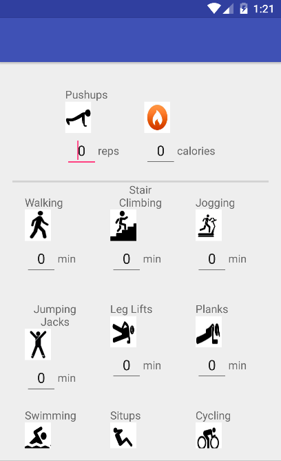
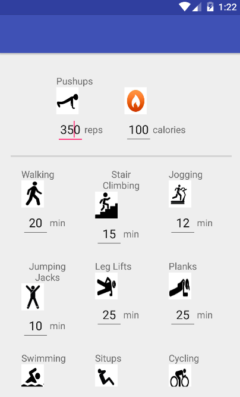
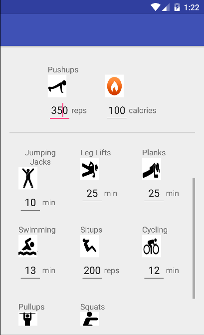
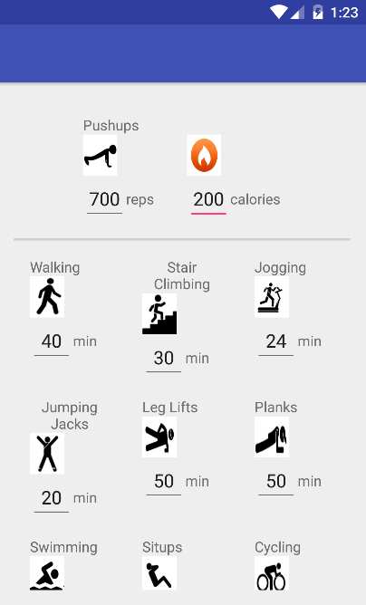
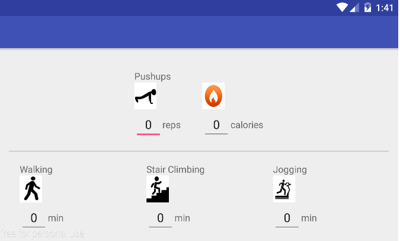

# PROG 01: Crunch Time

CrunchTime is a simple calorie converter for a multitude of exercises.
It can convert repetitions/minutes of a certain exercise (e.g. 50 pushups) into the number of calories burned, or vice versa.
It can also convert between exercises to burn an equal number of calories (e.g. 100 pullups = 20 minutes of walking).

CrunchTime assumes a user weight of 150 lbs.

## Authors

Vincent Wang ([vincent_wang@berkeley.edu](mailto:vincent_wang@berkeley.edu))

## Demo Video

See [Crunch Time Demo] (https://youtu.be/9zFr6TlYd8s)
Be sure to read the description!

## Screenshots

